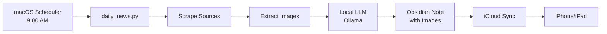

# Daily Tech News Agent 🤖📰

> Your personal AI that scrapes the internet, reads everything, and writes a beautiful daily tech digest in your Obsidian vault — automatically, every morning, for free.

[](https://opensource.org/licenses/MIT)
[](https://www.python.org/downloads/)

**What it does:**
- Scrapes Reddit, Twitter (via Nitter), major news outlets, tech blogs, biology journals, and startup news
- Extracts article images and text
- Summarises everything using a local LLM (Ollama) or cloud API
- Writes a structured, beautiful Obsidian note every morning at 9 AM
- Syncs to your iPhone/iPad automatically via iCloud (free)

**Zero cost. Zero maintenance. Completely local (or use free cloud APIs).**

---

## Example Output

Here's what you wake up to every morning in Obsidian:

```markdown
# Tech Brief — Wednesday, April 22, 2026

## 🔥 Top Stories
- [OpenAI Speeds Up Agentic Workflows with WebSockets] — 2-3 sentence summary with embedded image
- [Gemma 4 VLA Running on Edge Devices] — why it matters, with image
- ...

## 🤖 AI & Machine Learning
- Latest models, research, and product launches (with images)

## 🧬 Biology & Life Sciences
- Breakthroughs in genomics, neuroscience, longevity research

## 🚀 Startups & Venture Capital
- Funding rounds, VC insights, YC news

## 🔬 Science & Research
- Nature, Science, Quanta Magazine highlights

## 💬 Reddit Buzz
- What r/MachineLearning, r/startups, r/biotech are discussing

## 🐦 Tweets Worth Reading
- Notable posts from @karpathy, @pmarca, @EricTopol, etc.

## 🔭 Today's Deep Dive
- One story explained in depth (2-3 paragraphs with image)

## 📌 Quick Hits
- Everything else in bullet form
```

---

## Features

- **40+ sources** — Reddit (20+ subreddits), Twitter (25+ accounts), tech blogs, biology journals, startup news, major news outlets (WSJ, Reuters, BBC, NYT, Guardian, Economic Times)
- **Article images** — Automatically extracted and embedded in Obsidian
- **100% local** — Uses Ollama (runs on your Mac, completely private) or free cloud APIs (Groq, Zhipu GLM)
- **Fast & lightweight** — 2GB model, ~6-7 minutes per run on M1 MacBook Air
- **iPhone sync** — Vault lives in iCloud Drive, syncs to Obsidian Mobile for free
- **Fully automated** — Runs at 9 AM daily via macOS scheduler (launchd)
- **Customizable** — Edit `sources.yaml` to add/remove any RSS feed or Twitter account

---

## Quick Start

### Prerequisites

- macOS (tested on macOS 15+)
- Python 3.9+
- [Obsidian](https://obsidian.md) (free)
- [Homebrew](https://brew.sh) (optional but recommended)

### Installation

1. **Clone this repo:**
   ```bash
   git clone https://github.com/yourusername/daily-tech-news-agent.git
   cd daily-tech-news-agent
   ```

2. **Run setup:**
   ```bash
   bash setup.sh
   ```
   
   This script will:
   - Create a Python virtual environment
   - Install all dependencies
   - Install Ollama (if not already installed)
   - Download the AI model (~2 GB, one-time)
   - Create your Obsidian vault in iCloud Drive
   - Register the 9 AM daily scheduler
   - Run a test to verify everything works

3. **Open the vault in Obsidian:**
   - Launch Obsidian
   - Click "Open another vault" → "Open folder as vault"
   - Navigate to: `iCloud Drive → Obsidian → TechBrief`
   - Done! Your first brief is already there.

4. **iPhone setup (optional):**
   - Install Obsidian from App Store
   - Open app → tap vault icon → "Open from iCloud Drive"
   - Select `TechBrief`
   - Auto-syncs from that point on

---

## Configuration

### Change your sources

Edit `sources.yaml`:

```yaml
reddit:
  subreddits:
    - MachineLearning
    - YourFavoriteSubreddit   # Add any subreddit

twitter:
  accounts:
    - karpathy
    - YourFavoriteAccount     # Add any Twitter handle

blogs:
  feeds:
    - name: "Your Blog"
      url: "https://example.com/rss"
      category: "tech"
```

### Change the AI model

Edit `config.yaml`:

```yaml
llm:
  ollama:
    model: "llama3.2"    # or "qwen2.5:7b", "mistral", "gemma3:4b"
```

Available models (all free, all local):
| Model | Speed | Quality | Size | Best for |
|-------|-------|---------|------|----------|
| `llama3.2` | ⚡ Fast | Good | 2 GB | M1 Macs, fast iterations |
| `qwen2.5:7b` | Medium | Excellent | 4.7 GB | Better writing, M2/M3 |
| `mistral` | Medium | Great | 4 GB | Structured output |
| `gemma3:4b` | Fast | Good | 3.3 GB | Good balance |

To download a model: `ollama pull MODEL_NAME`

### Switch to cloud AI (still free)

If you prefer cloud over local, edit `config.yaml`:

**Option 1: Groq (free, very fast)**
```yaml
llm:
  provider: "openai"
  openai:
    api_key: "your-groq-api-key"
    base_url: "https://api.groq.com/openai/v1"
    model: "llama-3.3-70b-versatile"
```

**Option 2: Zhipu GLM-4-Flash (free forever)**
```yaml
llm:
  provider: "openai"
  openai:
    api_key: "your-zhipu-api-key"
    base_url: "https://open.bigmodel.cn/api/paas/v4/"
    model: "glm-4-flash"
```

Get API keys:
- Groq: https://console.groq.com (free tier: 14,400 requests/day)
- Zhipu: https://open.bigmodel.cn (completely free)

---

## Manual Run

Generate today's brief right now without waiting for 9 AM:

```bash
cd daily-tech-news-agent
source .venv/bin/activate
python daily_news.py --force
```

The `--force` flag regenerates even if today's brief already exists.

---

## What Gets Scraped

### Reddit (RSS — no login needed)
- **Tech & AI**: r/technology, r/MachineLearning, r/artificial, r/singularity, r/programming, r/compsci, r/LocalLLaMA
- **Biology**: r/biology, r/bioinformatics, r/biotech, r/longevity, r/genetics, r/Neuroscience
- **Startups**: r/startups, r/Entrepreneur, r/venturecapital, r/SaaS
- **Science**: r/science, r/Physics, r/Futurology

### Twitter (via Nitter RSS — free, anonymous)
- **AI Researchers**: @sama, @karpathy, @ylecun, @geoffreyhinton, @demishassabis
- **AI Companies**: @OpenAI, @AnthropicAI, @GoogleDeepMind, @MistralAI
- **Biologists**: @EricTopol, @dgmacarthur, @Bill_Hanage, @edyong209, @Neuro_Skeptic, @ProfAliceRoberts
- **VCs**: @pmarca, @balajis, @paulg, @naval, @a16z, @sequoia, @GV, @patio11

### Tech Blogs
Hacker News, Ars Technica, MIT Technology Review, The Verge, Wired, TechCrunch, IEEE Spectrum, Hugging Face, Google AI Blog, OpenAI News

### Major News Outlets
Wall Street Journal, Economic Times, Financial Times, Reuters, Bloomberg, The Guardian, BBC, CNN, New York Times, Washington Post

### Biology Journals & Blogs
Nature Biology, Cell Journal, PLOS Biology, bioRxiv, The Scientist, Science Daily

### Startup & VC News
Y Combinator Blog, Andreessen Horowitz (a16z), Crunchbase News, VentureBeat, First Round Review

---

## Project Structure

```
daily-tech-news-agent/
├── daily_news.py              # Main agent (scrapes, summarizes, writes)
├── sources.yaml               # All your news sources (customize freely)
├── config.yaml.example        # Template config (copy to config.yaml)
├── requirements.txt           # Python dependencies
├── setup.sh                   # One-click installer
├── com.user.dailynews.plist  # macOS scheduler template
├── README.md                  # This file
└── LICENSE                    # MIT License
```

---

## How It Works



1. **9 AM trigger**: macOS launchd wakes up and runs the script
2. **Scraping**: Fetches RSS feeds from 40+ sources (~2 min)
3. **Image extraction**: Grabs og:image from each article
4. **Summarization**: Local Ollama model reads everything and writes the brief (~4 min)
5. **Writing**: Saves a structured Markdown note to your Obsidian vault
6. **Sync**: iCloud automatically syncs to your iPhone

Total time: ~6-7 minutes on M1 MacBook Air with `llama3.2`

---

## Requirements

**Automatically installed by `setup.sh`:**
- Python 3.9+
- feedparser, requests, beautifulsoup4, lxml, PyYAML, openai, rich
- Ollama (local LLM runtime)

**You need to install separately:**
- [Obsidian](https://obsidian.md/download) (free)
- [Homebrew](https://brew.sh) (optional, but makes Ollama install easier)

---

## Troubleshooting

| Issue | Solution |
|-------|----------|
| "Ollama is not running" | Run `ollama serve` in Terminal, or install Ollama from https://ollama.com |
| "Model not found" | Run `ollama pull llama3.2` (or your configured model) |
| No brief at 9 AM | Your Mac must be awake at 9 AM. Check logs: `cat ~/Library/Logs/daily-news-stderr.log` |
| Twitter/Nitter not working | Nitter instances go offline sometimes. Script auto-falls back to other sources. You can disable Twitter in `sources.yaml`. |
| Slow on M1 Air | Use `llama3.2` (2GB, fast) instead of `qwen2.5:7b` (4.7GB, slow). Edit `model:` in `config.yaml`. |
| Want to uninstall scheduler | Run: `launchctl unload ~/Library/LaunchAgents/com.user.dailynews.plist` |

---

## Advanced Usage

### Change the schedule time

Edit `config.yaml`:
```yaml
schedule:
  time: "07:00"  # 7 AM instead of 9 AM
```

Then re-run `setup.sh` to update the scheduler.

### Change brief length

```yaml
brief:
  length: "short"   # ~600 words (or "medium" ~1200, "long" ~2000)
```

### Run in quiet mode (no terminal output)

```bash
python daily_news.py --quiet
```

The scheduler automatically uses `--quiet` mode.

### Run in a cron job (alternative to launchd)

Add to your crontab:
```bash
0 9 * * * cd /path/to/daily-tech-news-agent && source .venv/bin/activate && python daily_news.py --quiet
```

---

## Customization Ideas

- **Focus on AI only**: Remove biology/startup sources from `sources.yaml`
- **Add your local language news**: Add RSS feeds from your country's tech sites
- **Track specific companies**: Add their RSS feeds to `sources.yaml`
- **Follow your friends**: Add their Twitter handles (if they're public)
- **Change note format**: Edit the prompt in `daily_news.py` (line ~464)
- **Add more categories**: Modify the LLM prompt to include new sections

---

## Technical Details

**Why Ollama?**
- Completely local — nothing leaves your Mac
- No API costs, no rate limits, no internet dependency
- Privacy-focused — great for reading paywalled content or sensitive news

**Why Nitter for Twitter?**
- Twitter's official API costs $100/month
- Nitter is free, anonymous, and provides RSS feeds
- Downside: Instances go offline occasionally (script handles this gracefully)

**Why iCloud for sync?**
- Obsidian Sync costs $8/month
- iCloud is free (up to 5 GB) and you already have it
- Works perfectly for text notes

**Performance:**
- **Scraping**: ~2-3 minutes for 40+ sources
- **LLM inference**: ~4-5 minutes for llama3.2 (3B model) on M1 Air
- **Total**: ~6-8 minutes per run
- **Storage**: ~2 GB for the model, ~1 MB per daily note

---

## Inspiration

Heavily inspired by [reysu/ai-life-skills](https://github.com/reysu/ai-life-skills) — the best collection of AI agent skills for personal productivity.

---

## Contributing

PRs welcome! Some ideas:
- Add more intelligent deduplication (currently basic title matching)
- Support more news sources (podcasts, YouTube channels, newsletters)
- Add sentiment analysis to track story momentum
- Generate charts showing trending topics over time
- Multi-language support for non-English sources

---

## License

MIT License — see [LICENSE](LICENSE) file.

---

## FAQ

**Q: Does this work on Windows/Linux?**  
A: The core Python script works cross-platform, but the scheduler (`setup.sh` and `.plist`) is macOS-only. On Linux, use cron instead of launchd. On Windows, use Task Scheduler.

**Q: Can I use this without Obsidian?**  
A: Yes! Just edit `daily_news.py` to write to a different format (plain markdown, HTML, email, Notion API, etc.).

**Q: Will this get me banned from Reddit/Twitter?**  
A: No — you're using public RSS feeds, which are explicitly provided for this purpose. The script respects rate limits (1-2 second delays between requests).

**Q: Can I run this on a server (Raspberry Pi, AWS, etc.)?**  
A: Yes, but you'll need to sync the vault back to your Mac/iPhone somehow (rsync, Dropbox, Git, etc.). The easiest setup is just running it on your Mac.

**Q: How much does Ollama use my battery?**  
A: Negligible — it runs for ~4 minutes once per day. Less battery than watching a YouTube video.

**Q: Can I make it run twice a day (morning + evening)?**  
A: Yes! Duplicate the launchd plist with a different time, or add a second `StartCalendarInterval` dict to the existing plist.

---

## Acknowledgments

- [Ollama](https://ollama.com) — local LLM runtime
- [Nitter](https://nitter.net) — privacy-focused Twitter frontend
- [feedparser](https://github.com/kurtmckee/feedparser) — RSS parsing
- [Beautiful Soup](https://www.crummy.com/software/BeautifulSoup/) — HTML parsing
- [reysu/ai-life-skills](https://github.com/reysu/ai-life-skills) — the OG inspiration

---

**Built with love by [Achuth Kartha](https://github.com/yourusername)**

*If this saves you time every morning, give it a star! ⭐*
