# TechBriefer

> **A hallucination-proof daily news pipeline for your Obsidian vault.**
> 50+ trust-weighted RSS feeds → concurrent scrape → heuristic rank → strict-JSON local LLM summary → two-tier Markdown brief, every morning, in under 4 minutes.

[](https://www.python.org/)
[](https://ollama.com/)
[](LICENSE)
[]()
[]()

---

## What you get

A note like `01 Daily Briefs/2026-04-26 Tech Brief.md` that opens in Obsidian with the following structure:

```
─────────────────────────────────────────────
   Second Brain Brief — Sun, Apr 26, 2026
   33 stories · 48 sources · 3m 57s
─────────────────────────────────────────────

  Continuing from yesterday   [[OpenAI]] · [[Claude]] · [[CRISPR]]
  Top Stories          5      image + 2-sentence LLM summary
  AI & ML              1+5    Featured arXiv paper pin + 5 stories
  Biology & Life Sci   1+4    Featured bioRxiv paper pin + 4 stories
  Startups & VC        4      2-sentence LLM summary
  Quick Hits          ~25     grouped by shared entity (e.g.
                              "Anthropic (3)", "CRISPR (2)", "Other")
```

Every story links back to the original source, gets `[[wikilinks]]` for any
people / orgs / topics the regex catches, and shows which feed it came from
so you can audit anything you read.

### What each block does

- **Continuing from yesterday** — entities that appeared in yesterday's brief
  *and* in today's top 5 stories. SQLite-backed; turns the feed into a
  narrative instead of a flat daily snapshot.
- **Featured paper pin** — within AI and Biology, the highest-scored
  preprint from arXiv / bioRxiv / medRxiv is pulled to the top of the
  section and labeled, so research never gets buried under blog posts.
  The pin searches the *full ranked list* (not just the top-40 prefilter),
  so a Friday arXiv paper still gets pinned on a Sunday brief when fresher
  blog posts out-rank it on recency alone.
- **Author-weighted scoring** — a separate `authors.yaml` adds bonus weight
  to specific bylines (Karpathy, Topol, Ben Thompson, Tyler Cowen, Lenny,
  Packy, Paul Graham, Lilian Weng, etc.), so signal stays surfaced regardless
  of which feed it happens to publish through. Boosted stories are tagged
  inline with `(signal-boosted author)` in the brief.
- **Cluster dedup** — when 3 sources cover the same launch, the brief shows
  it once, picking the highest-trust source (e.g., DeepMind's blog over a
  TechCrunch recap). The cross-feed coverage still boosts the score, so
  consensus stories still rank higher.
- **Entity-grouped Quick Hits** — the ~25-story roundup at the bottom is
  organized by shared entity (`### Anthropic (3)`, `### CRISPR (2)`, …)
  instead of one flat bullet list. Makes scanning much faster.

---

## Pipeline

```mermaid
flowchart LR
    A([main.py]) --> B[scraper.fetch_all<br/>10-worker pool<br/>~50 feeds]
    B --> C[db.get_seen_urls<br/>7-day window]
    C --> D[ranker.cluster_and_score<br/>SequenceMatcher 0.78<br/>highest-weight rep wins]
    D --> E[apply_quotas<br/>ai 5 / bio 4 / vc 4]
    E --> F[prefilter top 40]
    F --> G[enricher.enrich_all<br/>og:image + body 2000c<br/>only if RSS &lt; 250c]
    G --> H[summarizer.summarize<br/>2 × 6-story batches<br/>strict JSON, temp=0]
    H --> I[validator<br/>reject hedging/empty]
    I --> J[writer.build_note<br/>continuing + paper pins<br/>+ entity-grouped Quick Hits]
    J --> K[(Obsidian vault)]
    J --> L[db.mark_seen<br/>db.save_daily_entities]

    classDef stage fill:#1e293b,stroke:#475569,color:#f8fafc
    classDef io fill:#0f766e,stroke:#0d9488,color:#f0fdfa
    class B,C,D,E,F,G,H,I,J stage
    class A,K,L io
```



### Stage timings (typical, llama3.2 3B on Apple Silicon)

| Stage | Time |
|---|---|
| Concurrent RSS fetch (50+ feeds, 10 workers) | 5–10 s |
| Rank + cluster + quotas + prefilter | < 6 s |
| Selective article enrichment (≤12 fetches) | 1–5 s |
| **LLM summaries** (2 batches of 6, strict JSON) | **180–210 s** |
| Markdown build + file write | < 1 s |
| **Total** | **~3–4 min** |

---

## Why it doesn't hallucinate

| Risk | Mechanism |
|---|---|
| LLM invents URLs | LLM never sees URLs. Returns `{"i": 3, ...}`; Python maps `i` back to the story it sent in. |
| LLM invents titles | Same — Python uses its own RSS title for rendering. |
| LLM fabricates facts | Prompt: *"Use ONLY information in the provided text."* `temperature=0`, `response_format=json_object`. |
| Hedging / refusals slip through | Validator rejects empty / >320 chars / contains `I think \| may be \| cannot \| knowledge cutoff \| as an AI \| sorry`. Falls back to a cleaned RSS summary. |
| Future dates / made-up numbers | LLM never sees "today". The grounding text is its only fact source. |
| Image hallucination | Images come from `og:image` / `twitter:image` only, must start with `https://`. LLM never picks images. |
| Cross-batch confusion | Stories are batched in groups of 6 with `=== STORY N ===` delimiters so the small model never mixes indices. |
| Repeat stories | 7-day SQLite dedup table (`history.db`, gitignored). |
| Source widening | Sources are a closed set in `sources.yaml`. The LLM cannot add to it. |

---

## Sources

53 feeds out of the box, weighted to bias toward primary research and
canonical AI labs. Edit `sources.yaml` to add, remove, or retune.

| Category | Feeds |
|---|---|
| **AI primary research** | arXiv (cs.AI / cs.LG / cs.CL / cs.CV) — via `export.arxiv.org/api/query`, so available 7 days a week |
| **AI labs** | OpenAI · DeepMind · Google AI · Microsoft Research · Hugging Face · Allen AI · BAIR · MIT CSAIL · MIT News AI |
| **AI analysts / blogs** | Karpathy · Lilian Weng · Chip Huyen · Eugene Yan · The Gradient · Towards Data Science · Ars Technica AI · ScienceDaily AI |
| **Biology research** | bioRxiv · medRxiv · arXiv q-bio · Nature Biotech / Methods / Medicine · Cell · Cell Systems · Science Translational Medicine · PLoS Comp Bio |
| **Biology analysts** | Eric Topol · STAT News · FierceBiotech · Quanta Magazine · ScienceDaily Genetics |
| **Startups / VC** | Paul Graham · Stratechery · Sequoia · YC · Elad Gil · Lenny's Newsletter · Not Boring · Crunchbase · TechCrunch · Benedict Evans · Balaji · Marginal Revolution · The Diff |
| **Reddit (upvote-gated)** | r/MachineLearning (≥200) · r/LocalLLaMA (≥150) · r/biotech (≥100) · r/startups (≥100) |

---

## Setup

### Prerequisites

- Python 3.10+
- [Ollama](https://ollama.com) running locally (`ollama serve`)
- `ollama pull llama3.2` (any 3B+ instruct model works; edit `config.yaml`)
- An Obsidian vault somewhere on disk

### Install

```bash
git clone https://github.com/Kartha-33/TechBriefer.git
cd TechBriefer
python3 -m venv .venv
.venv/bin/pip install -r requirements.txt
```

### Configure

Open `config.yaml` and point `obsidian.vault_path` at your vault:

```yaml
obsidian:
  vault_path: "~/Documents/Obsidian/MyVault"
  daily_notes_folder: "01 Daily Briefs"
```

Defaults for the LLM, scraper, pipeline sizes, and category quotas work out
of the box.

### Run it once

```bash
.venv/bin/python3 main.py --force
```

| Flag | Effect |
|---|---|
| `--force` | Ignore the 7-day seen-URL filter (handy when iterating) |
| `--dry-run` | Skip the LLM call and the file write; just preview the brief |

After ~3 minutes you'll see `<your-vault>/01 Daily Briefs/YYYY-MM-DD Tech Brief.md`.

---

## Schedule

### macOS (launchd)

A template lives at `com.secondbrain.dailynews.plist.template`. Replace the
`REPLACE_WITH_YOUR_PATH` markers with the absolute path to your clone, drop
it into `~/Library/LaunchAgents/`, and load it:

```bash
sed "s|REPLACE_WITH_YOUR_PATH|$(pwd)|g" \
    com.secondbrain.dailynews.plist.template \
    > ~/Library/LaunchAgents/com.secondbrain.dailynews.plist

launchctl bootstrap gui/$(id -u) \
    ~/Library/LaunchAgents/com.secondbrain.dailynews.plist
```

Fires at 07:00 every morning. Logs land in `/tmp/secondbrain.log` and
`/tmp/secondbrain.err`. Stop it with:

```bash
launchctl bootout gui/$(id -u)/com.secondbrain.dailynews
```

### Linux (cron)

```cron
0 7 * * * cd /path/to/TechBriefer && .venv/bin/python3 main.py >> /tmp/secondbrain.log 2>&1
```

---

## Tuning

| Want to … | Edit |
|---|---|
| Add more sources | `sources.yaml` (add a `{name, url, category, weight}` entry) |
| Bias toward one publication | Bump its `weight` in `sources.yaml` (5 = noise floor, 10 = top journal) |
| Boost a specific author | Add `{ match: "Their Name", bonus: 3 }` to `authors.yaml` |
| Make a section bigger | Bump `quotas.<category>` in `config.yaml` |
| Get deeper LLM coverage | Bump `pipeline.top_deep` (each +6 adds ~90 s to the run) |
| Switch the model | Change `llm.model` to any model Ollama serves locally |
| Tighten / loosen dedup window | `pipeline.history_days` (default: 7) |

---

## Project layout

```
TechBriefer/
├── main.py            ← orchestrator (--force, --dry-run, stage timings)
├── scraper.py         ← concurrent RSS fetch
├── ranker.py          ← heuristic score + cluster (highest-weight rep) + quotas
├── enricher.py        ← og:image + article body
├── summarizer.py      ← strict JSON LLM call + validator
├── entities.py        ← regex wikilink extraction
├── writer.py          ← Markdown builder, paper pins, entity-grouped Quick Hits
├── db.py              ← SQLite 7-day dedup + 14-day daily entity log
├── config.yaml        ← all knobs
├── sources.yaml       ← 53 feeds, weighted by trust
├── authors.yaml       ← per-author weight bonuses (Karpathy, Topol, …)
├── requirements.txt   ← feedparser, requests, beautifulsoup4, openai, pyyaml
├── com.secondbrain.dailynews.plist.template  ← launchd schedule
└── README.md
```

`history.db`, `.venv/`, and `__pycache__/` are gitignored.

---

## License

MIT — see [LICENSE](LICENSE).
